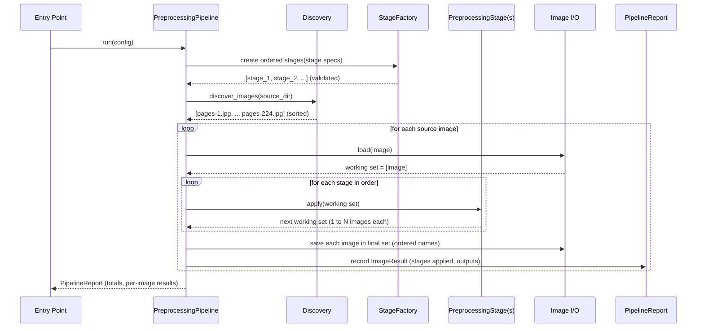

# Design Document: Image Preprocessing Pipeline

## Overview

The Image Preprocessing Pipeline is a **standalone, pluggable preprocessing tool** that runs
*before* the Phase 2 extraction pipeline. Rather than a single-purpose script, it is a general
**pipeline of ordered, pluggable stages**: each stage is an interchangeable component that
transforms a working set of images, and stages are selected and ordered entirely through
configuration. This broadens the earlier "page splitter" concept (`.kiro/specs/image-page-splitter/`)
into a reusable framework where page splitting is simply the first of several possible stages.

The pipeline mirrors the architecture already established in `phase_2/image_batch_processor/`:
a **Strategy/plugin pattern** for stages (analogous to `ExtractionEngine`), a **Factory** that
maps a string type to an implementation and validates its config (analogous to `EngineFactory`),
a **Pydantic** configuration hierarchy with cross-field validation (analogous to
`BatchProcessorConfig` + `EngineConfig`), lightweight **dataclass** results and reports
(analogous to `ProcessingResult` / `BatchReport`), and a template-method **orchestrator** with
per-image failure isolation (analogous to `BatchProcessor`). This keeps the two tools
conceptually consistent so contributors familiar with one immediately understand the other.

Two concrete stages ship in the first version. **Page splitting** takes each source photo of an
open book — two facing pages with the spine roughly centered — and cuts it into a left page and a
right page (a one-input-to-many-outputs transform). **Contrast enhancement** increases the
contrast between text and page background to improve downstream OCR/VLM extraction (a
one-input-to-one-output transform). Because stages can be 1→1 or 1→N, the pipeline data model is
built around a **working set of images**: each stage consumes the current set and produces the
next set, so the number of images can grow (splitting) or stay the same (enhancement) as the set
flows through the ordered stages. The two shipped stages (page split, contrast) are just the
initial set: the architecture is explicitly designed to accommodate an **open-ended, growing set
of stages**. Additional stages — for example sharpening, rectilinear alignment (deskew /
perspective correction so page edges and text lines are axis-aligned), denoise, binarization,
dewarp, and rotation — can be added later purely as new plugins, without changing the orchestrator.

Integration is deliberately **decoupled** from the CrewAI extraction flow. The current pipeline
(`initialize_workflow → create_engine → discover_images → process_images → generate_report`)
exposes no preprocessing hook, and extraction engines only expose `extract_text`/`validate_config`.
So the preprocessing pipeline is a **separate tool**: it reads from a source directory (default
`phase_1/cookbook_images/`), applies the configured stages, and writes fully processed
single-page images to an output directory. The user then points the existing image batch
processor's `image_dir` at that output directory. `ImageBatchProcessorFlow` is **not** modified,
and the Phase 1 source images remain **read-only and immutable**.

## Architecture

The pipeline reuses the layered structure of the image batch processor. An orchestration layer
(the `PreprocessingPipeline`) drives an **ordered list of pluggable stages**. Each stage is
created by a `StageFactory` from a validated Pydantic config and conforms to a common
`PreprocessingStage` contract. Image loading, cropping, and saving are isolated in an Image I/O
utility layer so stages stay focused on their transform logic. The orchestrator discovers the
source images, seeds the initial working set, threads that set through each stage in order, and
writes the final set to the output directory with deterministic, reading-order-preserving names.

```mermaid
graph TD
    CLI[Standalone Entry Point<br/>main / CLI] --> PP[PreprocessingPipeline<br/>orchestrator]
    PP --> DISC[Image Discovery<br/>utility]
    PP --> FAC[StageFactory]
    FAC --> STAGE[PreprocessingStage<br/>interface]
    STAGE --> SPLIT[PageSplitStage<br/>1 to N]
    STAGE --> CONTRAST[ContrastEnhancementStage<br/>1 to 1]
    STAGE --> FUTURE[Future stages (open-ended, growing set):<br/>sharpening / rectilinear alignment<br/>deskew + perspective / denoise<br/>binarize / dewarp / rotation]
    PP --> IO[Image I/O utility<br/>load / crop / transform / save]
    PP --> REP[PipelineReport]

    subgraph Config
        CFG[PipelineConfig<br/>Pydantic] --> FAC
        CFG --> PP
        SCFG[StageConfig hierarchy<br/>per-stage subclasses] --> FAC
    end

    subgraph Inputs/Outputs
        SRC[(phase_1/cookbook_images<br/>pages-N.jpg — READ ONLY)] --> DISC
        IO --> OUT[(output dir<br/>processed single-page images)]
    end
```

### Stage ordering and the working set

The core abstraction is a **working set** of in-memory images that flows through the ordered
stages. The orchestrator seeds the working set from one source image, then applies each stage in
configured order. A 1→1 stage (contrast) maps each image in the set to one output image; a 1→N
stage (page split) maps each image to one or more output images. The set produced by stage *k*
becomes the input to stage *k+1*. After the last stage, every image in the final set is written
to the output directory.


### Processing flow



### Design decisions and rationale

- **Pipeline of pluggable stages, not a single tool.** The earlier design solved one problem
  (splitting). Generalizing to an ordered list of stages behind a common contract lets us add
  contrast enhancement now and sharpening, rectilinear alignment (deskew / perspective
  correction), denoise, binarize, dewarp, and rotation later without touching the orchestrator —
  the same open-for-extension mechanism the extraction engines use. The architecture is explicitly
  designed for an **open-ended, growing set of stages**; the two shipped stages (page split,
  contrast) are only the initial set, and more are expected to be added over time.
- **Strategy pattern for stages.** Each stage is an interchangeable implementation of one
  interface. The orchestrator depends only on the interface, so stages are independently testable
  and swappable.
- **Factory + Pydantic config, mirroring `EngineFactory`.** Stages are selected by string type
  and validated config; cross-field validation ensures each stage's config subclass matches its
  declared type, exactly as `BatchProcessorConfig.validate_engine_config_matches_type` does for
  engines.
- **Ordered, reorderable configuration.** The stage list is data. Reordering, adding, or removing
  stages is a config change, not a code change (e.g. run contrast before or after splitting).
- **Working-set model handles 1→1 and 1→N uniformly.** Treating each stage as a transform from a
  set of images to a set of images means the orchestrator does not special-case splitting versus
  enhancement; growth in image count is a natural property of the data flow.
- **Standalone, decoupled preprocessing.** There is no preprocessing hook in the CrewAI flow, so
  this is a separate tool. Output goes to a new directory; `phase_1/cookbook_images/` stays the
  immutable source of truth. Integration with extraction is by convention: point the batch
  processor's `image_dir` at the pipeline's `output_dir`.
- **Deterministic, offline, no network.** Every stage is pure local image processing, making the
  pipeline fast, reproducible, and a strong fit for property-based testing.

## Components and Interfaces

### Component 1: PreprocessingPipeline (orchestrator)

**Purpose**: Coordinates the end-to-end preprocessing run: discover source images, build the
ordered list of stages from configuration, and for each source image thread a working set of
images through every stage in order, then write the final set to the output directory and
aggregate results into a report. Analogous to `BatchProcessor` in the extraction pipeline
(template-method style).

**Responsibilities**:
- Discover eligible source images in the input directory in a stable, sorted order.
- Construct the ordered stage list once (via the factory) and reuse it across all images.
- For each source image, seed a single-image working set, apply each stage in order, and collect
  the final working set.
- Name and write every image in the final set deterministically so downstream reading order is
  preserved across the whole dataset (see Output naming scheme).
- Isolate per-image failures so one bad photo or one failing stage does not abort the batch;
  record the failure and continue with the next source image.
- Optionally process source images concurrently (mirroring the batch processor's `max_workers`),
  since stages are stateless with respect to shared mutable state.
- Produce a `PipelineReport` summarizing successes, failures, output counts, and per-image detail.

**Collaborators**: `StageFactory` (to build stages), the Image I/O utility (load, transform,
crop, save), and the discovery utility.

### Component 2: PreprocessingStage (interface)

**Purpose**: The abstract contract every stage implements. It defines what it means to be a
pluggable step in the pipeline. Conceptually mirrors `ExtractionEngine`: a small, stable
interface the orchestrator depends on.

**Contract (described, not code)**:
- **Input**: a working set of one or more in-memory images (for a single source image, the set
  starts as exactly one image; later stages may receive several).
- **Output**: a new working set of one or more images. A 1→1 stage returns the same count it
  received (each image mapped to one transformed image); a 1→N stage may return more images than
  it received (each input image mapped to one or more outputs).
- **Configuration validation**: like engines, a stage can validate that it is properly configured
  before the run begins, surfacing configuration errors early.
- **Guarantees each implementation must uphold**:
  - It never mutates its input images in place; it produces new images (referential transparency,
    supporting deterministic re-runs).
  - It preserves the **relative order** of images: outputs derived from an earlier input image
    sort before outputs derived from a later input image, and within a single 1→N expansion the
    outputs are emitted in reading order (e.g. left page before right page).
  - It produces at least one output image per input image (no silent drops); a stage that wishes
    to reject an image raises a stage error rather than returning an empty set.
  - It performs no file I/O itself — it operates on in-memory images so it stays deterministic and
    unit-testable. Loading and saving are the orchestrator's/utility's responsibility.

**Responsibilities**:
- Apply one well-defined transform to each image in the working set.
- Declare its expansion behavior conceptually (1→1 or 1→N) so the orchestrator and reports can
  reason about output counts.

### Component 3: PageSplitStage (1→N)

**Purpose**: Splits a photo of an open book into separate left and right single-page images. This
is the 1→N stage: one input image yields (typically) two output images.

**Responsibilities**:
- Locate the spine/gutter column. Because the spine is only *roughly* centered, splitting supports
  two approaches selected by config: a **fixed-midpoint** approach (split at a configured fraction
  of the width, default the center) and a **content-aware gutter-detection** approach that finds
  the darker vertical fold band within a central search region, with automatic **fallback to the
  midpoint** when no confident gutter is found.
- Derive the left and right page regions from the spine column, optionally trimming a configurable
  gutter margin so the spine shadow is excluded from both pages.
- Emit the left page before the right page so reading order is preserved.
- Optionally treat designated images (e.g. front/back covers, which are a single logical page) as
  non-split pass-throughs producing exactly one output. This keeps the earlier page-splitter's
  cover handling available as configuration rather than special-casing it in the orchestrator.

**Notes**: The spine-location approach is itself a small internal strategy choice carried in the
stage's config; the two approaches share this stage rather than being separate top-level stages,
because they solve the same problem two ways.

### Component 4: ContrastEnhancementStage (1→1)

**Purpose**: Increases the contrast between text and page background to improve downstream
OCR/VLM extraction. This is the 1→1 stage: one input image yields exactly one output image with
the same dimensions.

**Responsibilities**:
- Apply a configurable contrast-enhancement transform (e.g. a contrast factor, or an adaptive
  method such as histogram equalization / CLAHE-style local contrast — the concrete method is a
  config choice).
- Preserve image dimensions and reading order (a pure per-image transform).
- Leave the image usable by all downstream stages and by the extraction engines (valid,
  saveable image in the configured output format).

### Component 5: StageFactory

**Purpose**: Creates configured `PreprocessingStage` instances from stage type strings and their
validated configs, and builds the ordered stage list for a run. Mirrors `EngineFactory`.

**Responsibilities**:
- Map a supported stage type (`"page_split"`, `"contrast_enhancement"`, and future types) to its
  implementation.
- Validate that the supplied config subclass matches the requested stage type, raising a clear
  error on mismatch (parallel to `EngineFactory`'s type/config check).
- Raise a clear error for unsupported stage types, listing supported types.
- Expose the set of supported stage types (parallel to `get_supported_engines`).

### Component 6: Image I/O utility

**Purpose**: Encapsulates all image file operations — load an image into memory, read its
dimensions, crop a region, and save an in-memory image to a target path — so the orchestrator and
stages remain free of I/O concerns. Extends the existing `utils/` conventions (`discover_images`,
`generate_output_filename`, `ensure_output_directory`).

**Responsibilities**:
- Load an image and expose its width/height; surface decode failures as a domain load error.
- Save an in-memory image to a destination path, creating the output directory as needed and
  preserving a sensible format/quality.
- Provide the discovery of eligible source files in stable sorted order (reusing or paralleling
  the existing `discover_images`).

### Component 7: Standalone entry point (CLI / main)

**Purpose**: Wires configuration to the `PreprocessingPipeline` and runs a batch, analogous to
`main.py`. Reads the source and output directories and the ordered stage configuration (with
sensible defaults for the cookbook dataset: source `phase_1/cookbook_images/`, a page-split stage
followed by a contrast stage), executes the run, and logs a summary.

**Responsibilities**:
- Build a validated `PipelineConfig` (including the ordered stage list).
- Invoke the pipeline, then log the `PipelineReport` summary (total sources, total outputs,
  successes, failures).
- Make clear in its output/help text that it is a standalone step run *before* extraction, and
  that the user points the batch processor's `image_dir` at this tool's `output_dir`.

## Data Models

Data models follow existing project conventions: Pydantic `BaseModel` for validated configuration
(as in `config/settings.py`) and lightweight dataclasses for results (as in `core/models.py`).
Descriptions below are conceptual — no field-level code or signatures.

### Model 1: PipelineConfig (Pydantic)

Top-level, validated run configuration.

| Field | Type | Description |
| --- | --- | --- |
| `source_dir` | string | Directory of source photos (default `phase_1/cookbook_images`). Read-only input. |
| `output_dir` | string | Directory where final processed images are written. |
| `stages` | ordered list of StageSpec | The ordered pipeline. Each entry names a stage type and carries its matching config. Order is significant and defines execution order. |
| `supported_extensions` | list of string | Eligible input extensions (default `[".jpg", ".jpeg", ".png"]`). |
| `output_format` | string | Output image format/extension (default: same as source). |
| `max_workers` | int | Optional per-source concurrency (default 1 = sequential), mirroring `BatchProcessor`. |

**Validation Rules**:
- `source_dir` and `output_dir` are non-empty (mirrors `BatchProcessorConfig` validators).
- `stages` is non-empty and each entry's `stage_config` type matches its declared `stage_type`
  (cross-field validation, mirroring `validate_engine_config_matches_type`).
- Every declared `stage_type` is a supported type.

### Model 2: StageSpec (Pydantic)

One entry in the ordered `stages` list, binding a stage type to its configuration.

| Field | Type | Description |
| --- | --- | --- |
| `stage_type` | enum: `page_split` \| `contrast_enhancement` (extensible) | Which stage implementation to build. |
| `stage_config` | StageConfig subclass | Stage-specific configuration; its concrete type must match `stage_type`. |

### Model 3: StageConfig hierarchy (Pydantic)

A base `StageConfig` (parallel to `EngineConfig`) with one subclass per stage type.

**PageSplitConfig**

| Field | Type | Description |
| --- | --- | --- |
| `method` | enum: `fixed_midpoint` \| `gutter_detection` | Spine-location approach. |
| `split_ratio` | float in (0, 1) | Fractional width for the fixed-midpoint split (default 0.5). |
| `gutter_margin` | float in [0, 0.5) | Fraction of width trimmed symmetrically around the spine (default 0.0). |
| `search_band_min` | float in (0, 1) | Left edge of the central search band for detection (default 0.35). |
| `search_band_max` | float in (0, 1) | Right edge of the central search band; must exceed `search_band_min` (default 0.65). |
| `fallback_ratio` | float in (0, 1) | Split ratio used when detection finds no confident gutter (default 0.5). |
| `cover_filenames` | list of string | Optional source filenames treated as single-page covers (carried through, not split). |
| `treat_first_last_as_covers` | bool | When true, first/last images in sorted order are covers (default false). |

**ContrastEnhancementConfig**

| Field | Type | Description |
| --- | --- | --- |
| `method` | enum: `linear` \| `histogram_equalization` \| `adaptive` | Contrast approach (default `linear`). |
| `factor` | float > 0 | Contrast multiplier for the linear method (default > 1 to increase contrast). |
| `clip_limit` | float > 0 | Contrast clip limit for the adaptive method (used when `method = adaptive`). |

### Model 4: WorkingImage (conceptual, in-memory)

Represents one image as it flows through the pipeline. Conceptual only — it carries the in-memory
image data, its dimensions, and provenance metadata used to derive deterministic output names
(the originating source name plus an ordered lineage of how it was produced, e.g. which split
half it came from). It is not persisted; only the final set is written.

| Field | Type | Description |
| --- | --- | --- |
| `source_name` | string | Original source filename this image descends from. |
| `lineage` | ordered list of tokens | Ordered suffixes describing how the image was produced (e.g. a left/right token from splitting), used to build deterministic, order-preserving output names. |
| `width` / `height` | int | Current pixel dimensions. |

### Model 5: ImageResult (dataclass)

Outcome of processing one **source** image through the whole pipeline. Mirrors `ProcessingResult`.

| Field | Type | Description |
| --- | --- | --- |
| `source_path` | string | Path to the source photo. |
| `success` | bool | Whether the source was processed without failure. |
| `output_paths` | list of string | Paths of all final images written for this source (1 or more). |
| `output_count` | int | Number of output images produced (e.g. 2 after a split, 1 for a cover or a pure 1→1 pipeline). |
| `stages_applied` | list of string | Ordered names of stages applied. |
| `error` | string or null | Error message when `success` is false (includes which stage failed, if applicable). |
| `processing_time` | float | Seconds spent on this source image. |

### Model 6: PipelineReport (dataclass)

Batch summary. Mirrors `BatchReport`, including a `success_rate()` accessor.

| Field | Type | Description |
| --- | --- | --- |
| `total_sources` | int | Number of source photos processed. |
| `successful` | int | Sources processed successfully. |
| `failed` | int | Sources that failed to process. |
| `total_output_files` | int | Total images written across all successful sources. |
| `processing_time` | float | Total run time in seconds. |
| `results` | list of ImageResult | Per-source detail. |
| `success_rate()` | float | `successful / total_sources` (0.0 when no sources), mirroring `BatchReport.success_rate()`. |

### Output naming scheme

Output names must keep global reading order intact under the sorted discovery the downstream batch
processor performs. Names are derived deterministically from each source's `source_name` and its
ordered `lineage`:

- A **1→1** pipeline (e.g. contrast only) keeps the source stem, producing one output per source
  that sorts identically to the source order.
- A **1→N** split emits outputs whose names order the left (first-read) page before the right
  (second-read) page — for example a left/right suffix such as `pages-N-a` before `pages-N-b` —
  so that within a source the reading order is preserved.
- Across the full dataset, outputs derived from `pages-N` sort before outputs derived from
  `pages-(N+1)`, so the concatenation of all outputs in sorted order reproduces the book's reading
  order (covers included: a front cover sorts first, a back cover last).

The exact suffix tokens are a naming-policy detail finalized in requirements/tasks. The
**invariants** are: naming is a pure function of source name plus lineage; every output name is
unique; within a split the left page sorts before the right page; and global source order is
preserved across the whole output set.

## Correctness Properties

These properties are candidates for Hypothesis property-based tests (per the project's testing
conventions: minimum 100 examples, one test per property, tagged with a feature/property comment).
They are stated at a high level here and will be mapped to specific requirements during
design→requirements→tasks.

### Property 1: Order preservation through the pipeline

For any ordered working set fed through any stage, outputs derived from an earlier input image
sort before outputs derived from a later input image, and the pipeline as a whole preserves global
source reading order in the final output names.

### Property 2: No silent drops (at-least-one output)

Every input image to a stage produces at least one output image; a full pipeline run produces at
least one output file for every successfully processed source (no images vanish).

### Property 3: 1→1 stage preserves count and dimensions

A 1→1 stage (contrast enhancement) returns exactly as many images as it received, and each output
image has the same dimensions as its corresponding input.

### Property 4: Split produces the expected page count

A page-split on an interior spread produces exactly two output images (left and right); a
designated cover produces exactly one.

### Property 5: Split regions within bounds and non-overlapping

For a split, both page regions lie entirely within the source image's pixel bounds, the left
region lies left of the spine and the right region right of it, and the two regions do not
horizontally overlap.

### Property 6: Non-degenerate outputs

Every output image has strictly positive width and height (no empty or zero-area images).

### Property 7: Spine within search bounds or flagged fallback

For content-aware gutter detection, the chosen spine column lies within the configured central
search band, or the fixed-midpoint fallback is used and recorded.

### Property 8: Deterministic naming

Output names are a pure function of source name and lineage; the left page sorts before the right
page within a split; no two outputs in a run collide.

### Property 9: Determinism of results

Running the same source image through the same ordered stage configuration twice yields identical
output images (byte-for-byte) and identical result metadata.

### Property 10: Source immutability

A pipeline run never modifies or deletes any file under the source directory; all writes occur
under the configured output directory.

### Property 11: Guaranteed result for readable input

For any readable image and valid configuration, the pipeline produces a valid final image set
(content-aware detection falls back to the midpoint rather than failing).

### Property 12: Per-source failure isolation

A failure on one source image (or a stage failing on it) is recorded as a failed `ImageResult` and
does not prevent the remaining sources from being processed.

## Error Handling

### Scenario 1: Unreadable or corrupt source image

**Condition**: A file matches a supported extension but cannot be decoded.
**Response**: Raise a domain error (e.g. `ImageLoadError`), record a failed `ImageResult` for that
source, and continue with the rest of the batch.
**Recovery**: The run completes; the failure is visible in the report for re-processing.

### Scenario 2: Stage transform failure

**Condition**: A stage cannot process an image (e.g. contrast method fails on an unexpected mode,
or split cannot form valid regions).
**Response**: The stage raises a `StageError` naming the stage; the orchestrator records a failed
`ImageResult` (including which stage failed) for that source and continues.
**Recovery**: Other sources are unaffected; the failed source is flagged for review.

### Scenario 3: Content-aware detection finds no confident gutter

**Condition**: The gutter-detection method finds a flat/low-contrast central band.
**Response**: Fall back to the fixed-midpoint split and record that a fallback was used.
**Recovery**: A valid split is still produced; the fallback is visible for review.

### Scenario 4: Output write failure

**Condition**: The destination is not writable or the disk is full.
**Response**: Raise a domain error (e.g. `ImageSaveError`); record the failure for that source.
**Recovery**: Partial outputs for that single source are clearly reported so downstream counts are
not silently wrong; other sources continue.

### Scenario 5: Invalid configuration

**Condition**: Empty directories, an empty stage list, an unknown stage type, a stage config that
does not match its declared type, or out-of-range parameters (ratios, bands, factors).
**Response**: Raise a configuration error at validation time (Pydantic), before any processing.
**Recovery**: The run aborts early with a clear message; no partial output is produced.

**Exception hierarchy** (mirrors `exceptions.py`): a base `PreprocessingError` with
`ImageLoadError`, `ImageSaveError`, `StageError`, and `ConfigurationError` subclasses. Where it
aids reuse, these parallel the existing `BatchProcessorError` family.

## Testing Strategy

### Unit Testing Approach

- **Stages**: verify `PageSplitStage` computes expected regions for given ratios/margins and both
  methods (fixed vs. detection with fallback), and that `ContrastEnhancementStage` preserves
  dimensions and count. Assert stage-contract guarantees (no in-place mutation, order preserved,
  at-least-one output).
- **Factory**: verify the correct stage is built per type, that mismatched configs and unknown
  types raise clear errors, and that the ordered stage list is constructed in configured order
  (parallels the `EngineFactory` tests).
- **Config**: verify Pydantic validation of ranges, non-empty paths, non-empty stage list, and
  stage-type/config matching.
- **Naming**: verify deterministic, order-preserving, collision-free output names for both 1→1 and
  1→N pipelines.
- **Orchestrator**: verify the working set threads through multiple stages in order, output counts
  aggregate correctly, and per-source failures are isolated.

### Property-Based Testing Approach

Property-based tests use **Hypothesis** (already a project dependency) with
`@settings(max_examples=100)` and the required feature/property comment tags. Strategies generate
synthetic images of varying dimensions and modes (and synthetic gutters for detection) rather than
relying on the real dataset, so properties hold across the input space. Each Correctness Property
maps to exactly one property-based test.

**Property Test Library**: Hypothesis.

### Integration Testing Approach

- Run the full pipeline end-to-end against a small fixture directory with a representative
  configuration (page split then contrast) and assert output counts, ordered names, and that every
  output is a readable image with expected dimensions.
- Confirm the output directory is directly consumable by the existing batch processor's
  `discover_images` (sorted order yields the correct reading sequence), validating the decoupled
  integration contract.
- Confirm the source directory is unchanged after a run (immutability).

## Performance Considerations

- The dataset is 224 photos and every stage is pure local image processing with no network calls,
  so a full run should complete in seconds to low minutes; throughput is not a primary concern.
- Splitting analyzes a column intensity profile over a central band (linear in pixel count) and
  contrast enhancement is a per-pixel transform; both are cheap.
- Processing is naturally parallelizable per source image (stages hold no shared mutable state),
  so the orchestrator can mirror the batch processor's optional `max_workers` thread pool if a
  larger dataset ever warrants it; v1 can run sequentially.
- The working set is held in memory per source image; since a single source expands to only a
  handful of images, memory pressure is negligible.

## Security Considerations

- The tool operates only on local files supplied via configuration and makes no network requests,
  so the attack surface is minimal.
- **Source images under `phase_1/` are treated as strictly read-only**; the pipeline never writes
  to, overwrites, or deletes the source of truth and only writes under the configured
  `output_dir`. This is asserted as a correctness property (Property 10).
- Path handling relies on `pathlib` with validated, non-empty directories; output directory
  creation is scoped to the configured `output_dir`.

## Dependencies

- **Pillow (PIL)** — image loading, cropping, transforming, and saving. New dependency to add via
  `uv`.
- **numpy** — column intensity profile analysis for content-aware gutter detection and array-based
  contrast operations. New dependency to add via `uv`.
- **pydantic** (>=2.12.5) — existing; configuration models and validation.
- **pytest** (>=9.0.1) — existing; unit/integration tests.
- **hypothesis** (>=6.148.5) — existing; property-based tests.

## Future Considerations (out of scope for v1)

- Additional stages as plugins. The set of stages is expected to keep growing over time; concrete
  examples already anticipated include:
  - **Sharpening** — sharpen text edges/strokes to improve OCR/VLM legibility.
  - **Rectilinear alignment (deskew / perspective correction)** — geometrically straighten pages
    so page edges and text lines are axis-aligned (correcting skew and perspective distortion from
    photographing a book at an angle).
  - Denoise, binarization, dewarp (perspective/curvature correction), and rotation.

  Each of these — including sharpening and rectilinear alignment/deskew — is added purely as a new
  `PreprocessingStage` implementation plus a `StageConfig` subclass and factory registration, with
  **no orchestrator change**. This is the whole point of the open-ended, pluggable-stage
  architecture: the two shipped stages (page split, contrast) are just the initial set.
- Auto-tuning detection parameters (search band, contrast method) from dataset statistics.
- A configuration file format (YAML/JSON) for declaring pipelines without code.
- Optional preview/debug output showing each stage's effect for tuning.
